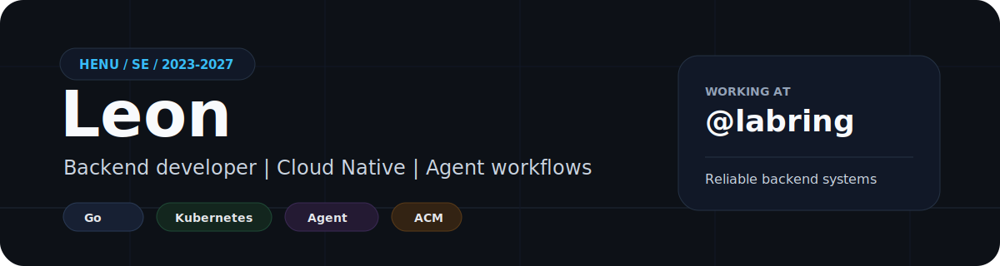

<p align="center">
  
</p>

# Leon

Backend developer at [@labring](https://github.com/labring), building reliable systems with Go, Cloud Native tooling, and Agent workflows. HENU / Software Engineering / 2023-2027.

**Focus:** Backend · Cloud Native · Agent · ACM · Web3

**Links:** [Blog](https://xianchaoqian.com) · [GoClub](https://goclub.space) · [KnowledgeGraph](https://leonincs.github.io/KnowledgeGraph/) · [Email](mailto:xianchaoqian@foxmail.com)

**Social:** [Bilibili: 布洛克琴](https://space.bilibili.com/491359383) · [小红书: 布洛克琴](https://www.xiaohongshu.com/user/profile/69248f0b000000003702b8d7?xsec_token=YBstH3OwE19B9v53xghZrydstBVVWI2wXWq8lwjrH9F7Q%3D&xsec_source=app_share&shareRedId=OD80NDtLNEs2NzUyOTgwNjk6OTlGPUpA&apptime=1777365113&share_id=8b97234768b843c1a3f733ca5829a418&share_channel=copy_link&appuid=69248f0b000000003702b8d7&xhsshare=CopyLink) · [Instagram](https://www.instagram.com/forever_mvp0?igsh=MXhnNjA3ZjFkbTZwbg==)

<p>
  
</p>

## Stack

```txt
Backend      Go / Gin / GORM
Data         MySQL / Redis / RabbitMQ
AI           LangChain / LangGraph / Agent workflows
Frontend     Vue / React
Infra        Docker / Kubernetes
```

## Activity

<!-- STATS:START -->
<table align="center">
  <tr>
    <td align="center"><b>349</b><br/><sub>Stars</sub></td>
    <td align="center"><b>1,916</b><br/><sub>Commits</sub></td>
    <td align="center"><b>29</b><br/><sub>Pull Requests</sub></td>
    <td align="center"><b>0</b><br/><sub>Issues</sub></td>
    <td align="center"><b>18</b><br/><sub>Repositories</sub></td>
  </tr>
</table>
<!-- STATS:END -->

<p align="center">
  <sub>Updated automatically with GitHub Actions.</sub>
</p>
